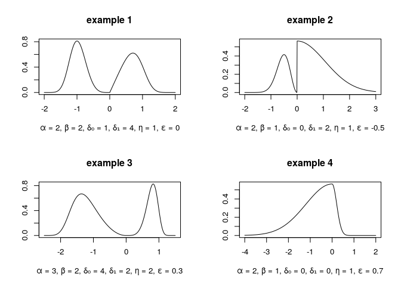

Package momcalc
================

<!-- README.md is generated from README.Rmd. Please edit that file -->

# Introduction

Package `momcalc` includes different functions to *calculate moments* of
some distributions. It is possible to calculate the moments of a normal,
lognormal or gamma distribution symbolically. These distributions may be
multivariate. The distribution or moments of the [BEGG
distribution](https://www.researchgate.net/publication/280136422_A_Bimodal_Extension_of_the_Generalized_Gamma_Distribution)
can be calculated numerically. Raw moments can be transformed into
central moments and vice versa. The package also provides a test
concerning the modality of a distribution. It tests, if a one
dimensional distribution with compact support can be unimodal and is
based on the moments of that distribution.

You can install `momcalc` from GitHub with:

``` r
# install.packages("devtools")
devtools::install_github("CharlotteJana/momcalc")
```

# Symbolical calculation of moments

Function `symbolicMoments` calculates the moments of a distribution
symbolically, meaning that it handles the input as quoted expression. It
can not only work with numbers as input but with any given expression.

The distribution may be multivariate and of some of the following types:
normal, lognormal or gamma. The type is specified with the argument
`distribution`. For `distribution = normal`, central moments are
calculated. In the other cases, function `symbolicMoments` returns raw
moments.

``` r
# raw moments of a one dimensional gamma distribution
symbolicMoments(distribution = "gamma", missingOrders = as.matrix(1:3, ncol = 1),
                mean = "μ", var = "σ")
#> [[1]]
#> σ * gamma(1 + μ^2/σ)/(μ * gamma(μ^2/σ))
#> 
#> [[2]]
#> gamma(2 + μ^2/σ) * (σ/μ)^2/gamma(μ^2/σ)
#> 
#> [[3]]
#> gamma(3 + μ^2/σ) * (σ/μ)^3/gamma(μ^2/σ)

# raw moments of a one dimensional lognormal distribution
symbolicMoments(distribution = "lognormal", missingOrders = as.matrix(1:2, ncol = 1),
                mean = 2, var = 1, simplify = FALSE)
#> [[1]]
#> exp(1 * (2 * log(2) - 0.5 * log(1 + 2^2)) + 0.5 * (1^2 * (log(1 + 
#>     2 * 2) - log(2) - log(2))))
#> 
#> [[2]]
#> exp(2 * (2 * log(2) - 0.5 * log(1 + 2^2)) + 0.5 * (2^2 * (log(1 + 
#>     2 * 2) - log(2) - log(2))))

# evaluate the result
symbolicMoments(distribution = "lognormal", missingOrders = as.matrix(1:2, ncol = 1),
                mean = 2, var = 1, simplify = TRUE)
#> [1] 2 5
```

Note that the calculation in case of a *normal* distribution is done
with function `callmultmoments` of package
[symmoments](https://cran.r-project.org/web/packages/symmoments/index.html).
The following example can be found on
[Wikipedia](https://en.wikipedia.org/wiki/Multivariate_normal_distribution#Higher_moments):

``` r
missingOrders <- matrix(c(4, 0, 0, 0,
                          3, 1, 0, 0,
                          2, 2, 0, 0,
                          2, 1, 1, 0,
                          1, 1, 1, 1), ncol = 4, byrow = TRUE)

cov <-  matrix(c("σ11", "σ12", "σ13", "σ14", 
                 "σ12", "σ22", "σ23", "σ24", 
                 "σ13", "σ23", "σ33", "σ34", 
                 "σ14", "σ24", "σ34", "σ44"), ncol = 4, byrow = TRUE)

symbolicMoments("normal", missingOrders, mean = "μ", cov = cov)
#> [[1]]
#> 3 * σ11^2
#> 
#> [[2]]
#> 3 * (σ11 * σ12)
#> 
#> [[3]]
#> 2 * σ12^2 + σ11 * σ22
#> 
#> [[4]]
#> 2 * (σ12 * σ13) + σ11 * σ23
#> 
#> [[5]]
#> σ12 * σ34 + σ13 * σ24 + σ14 * σ23
```

# Symbolical transformation of moments

Function `transformMoment` symbolically transforms raw moments into
central moments and vice versa. It allows the moments to come from a
multivariate distribution.

Let \(X\) be a (possible multivariate) random variable and \(Y\) the
corresponding centered variable, i.e. \(Y = X - μ\). Let
\(p = (p_1, ..., p_n)\) be the order of the desired moment.

#### Transformation from central into raw

In this case, set argument `type = 'raw'`. Then function
`transformMoment`
returns

<!-- E(X^p) = \sum_{k_1=0}^{p_1}...\sum_{k_n=0}^{p_n} {p \choose k} \mu^{p-k} E(Y^k)~. -->


#### Transformation from raw to central

In this case, set argument `type = 'central'`. Then function
`transformMoment`
returns

<!-- E(Y^p) = \sum_{k_1=0}^{p_1}...\sum_{k_n=0}^{p_n} (-1)^{p-k} {p \choose k} \mu^{p-k} E(X^k)~. -->


#### Class momentList

Function `transformMoment` needs as input an S3-object of class
`momentList` which contains all known central and raw moments. It has
four elements: Element `centralMoments` contains all known central
moments of the distribution, where as `rawMoments` contains all raw
moments of the distribution. Both are stored as list. The elements
`centralMomentOrders` and `rawMomentOrders` contain the corresponding
orders of the moments. They are stored as matrix or data.frame, each row
represents one order of the moment. The number of columns of these
matrices should be equal to the dimension of the distribution.

The function returns an object of class `momentList` which is expanded
and includes the wanted moment and all moments that were computed during
the calculation process.

#### Example

Calculate the raw moment \(E(X_1X_2X_3^2)\) for a three-dimensional
random variable \(X\):

``` r
mList <- momentList(rawMomentOrders = diag(3),
                    rawMoments = list("m1", "m2", "m3"),
                    centralMomentOrders = expand.grid(list(0:1,0:1,0:2)),
                    centralMoments = as.list(c(1, 0, 0, "a", 0, letters[2:8])))

mList <- transformMoment(order = c(1,1,2), type = 'raw', 
                         momentList = mList, simplify = TRUE)

mList$rawMomentOrders
#>   [,1] [,2] [,3]
#>      0    0    0
#>      1    0    0
#>      0    1    0
#>      0    0    1
#> p    1    1    2

mList$rawMoments
#> [[1]]
#> [1] 1
#> 
#> [[2]]
#> [1] "m1"
#> 
#> [[3]]
#> [1] "m2"
#> 
#> [[4]]
#> [1] "m3"
#> 
#> [[5]]
#> g * m1 + h + m2 * (e * m1 + f) + m3 * (2 * (b * m2) + 2 * (c * 
#>     m1) + 2 * d + m3 * (a + m1 * m2))
```

# The BEGG distribution

The *bimodal extension of the generalized Gamma-Distribution* (BEGG) was
first introduced in

  - Bulut, Y. M., & Arslan, O. (2015). [A bimodal extension of the
    generalized gamma
    distribution](https://www.researchgate.net/publication/280136422_A_Bimodal_Extension_of_the_Generalized_Gamma_Distribution).
    *Revista Colombiana de Estadística*, 38(2), 371-384.

It is a scale mixture of the generalized gamma distribution that is
almost always bimodal. The two modes can have different shapes,
depending on the parameters \(α\), \(β\), \(δ_0\), \(δ_1\), \(η\),
\(\epsilon\), \(μ\) and \(σ\).

The density function can be calculated with `dBEGG` and is given
by

<!-- f(x) = \begin{cases}  -->

<!--       \frac{\alpha\beta}{2\eta^\frac{\delta_1+1}{\alpha}(1+\epsilon)^{\delta_1}\Gamma\left(\frac{\delta_1+1}{\alpha\beta}\right)}~(-x)^{\delta_1}~e^{-\frac{(-x)^{\alpha\beta}}{\eta^\beta(1+\epsilon)^{\alpha\beta}}}~~~~ &if~x<0\\ -->

<!--       \frac{\alpha\beta}{2\eta^\frac{\delta_0+1}{\alpha}(1-\epsilon)^{\delta_0}\Gamma\left(\frac{\delta_0+1}{\alpha\beta}\right)}~x^{\delta_0}~e^{-\frac{x^{\alpha\beta}}{\eta^\beta(1-\epsilon)^{\alpha\beta}}}~~~~ &if~x\ge0\\ -->

<!-- \end{cases}  -->


The k-th raw moment can be calculated with `mBEGG` and is given
by

<!-- E(X^k) = \frac{(-1)^k\eta^{\frac{k}{\alpha}}(1+\epsilon)^{k+1}}{2}~\frac{\Gamma\left(\frac{\delta_1+k+1}{\alpha\beta}\right)}{\Gamma\left(\frac{\delta_1+1}{\alpha\beta}\right)}~+~\frac{\eta^{\frac{k}{\alpha}}(1-\epsilon)^{k+1}}{2}~\frac{\Gamma\left(\frac{\delta_0+k+1}{\alpha\beta}\right)}{\Gamma\left(\frac{\delta_0+1}{\alpha\beta}\right)} -->


The density function can have very different shapes:
<!-- -->

# Test if a distribution is unimodal

Function `is.unimoal` checks if an (unknown) distribution with compact
support can be unimodal. It uses several inequalities that were
introduced in

  - Teuscher, F., & Guiard, V. (1995). [Sharp inequalities between
    skewness and kurtosis for unimodal
    distributions](https://www.sciencedirect.com/science/article/pii/016771529400074I).
    *Statistics & probability letters*, 22(3), 257-260.
  - Johnson, N. L., & Rogers, C. A. (1951). [The moment problem for
    unimodal
    distributions](https://www.jstor.org/stable/2236630?seq=1#page_scan_tab_contents).
    *The Annals of Mathematical Statistics*, 433-439.
  - Simpson, J. A., & Welch, B. L. (1960). [Table of the bounds of the
    probability integral when the first four moments are
    given](https://www.jstor.org/stable/2333310?seq=1#page_scan_tab_contents).
    *Biometrika*, 47(3/4), 399-410.

Depending on the inequality, moments up to order 2 or 4 are required. A
distribution that satisfies all inequalities that contain only moments
up to order 2 is called **2-b-unimodal**. A distribution that satisfies
all inequalities that contain only moments up to order 4 is called
**4-b-unimodal**. It is possible that a multimodal distribution
satisfies all inequalities and is therefore 2- and even 4-bimodal. But
if at least one of the inequalities is not satisfied, the distribution
cannot be unimodal. In this case, the test returns `not unimodal` as
result.

Here are some examples using the BEGG distribution:

``` r
# example 1 (bimodal)
example1 <- mBEGG(order = 1:4, alpha = 2, beta = 2, delta0 = 1, delta1 = 4, eta = 1, eps = 0)
is.unimodal(-2, 2, example1)
#> [1] "not unimodal"

# example 2 (bimodal)
example2 <- mBEGG(order = 1:4, alpha = 2, beta = 1, delta0 = 0, delta1 = 2, eta = 1, eps = -0.5)
is.unimodal(-2, 3, example2)
#> [1] "4-b-unimodal"

# example 3 (bimodal)
example3 <- mBEGG(order = 1:4, alpha = 3, beta = 2, delta0 = 4, delta1 = 2, eta = 2, eps = 0.3)
is.unimodal(-2.5, 1.5, example3[1:2]) # test with moments of order 1 and 2
#> [1] "2-b-unimodal"
is.unimodal(-2.5, 1.5, example3) # test with moments of order 1 - 4
#> [1] "not unimodal"

# example 4 (unimodal)
example4 <- mBEGG(order = 1:4, alpha = 2, beta = 1, delta0 = 0, delta1 = 0, eta = 1, eps = 0.7)
is.unimodal(-4, 2, example4)
#> [1] "4-b-unimodal"
```

# License

Function `dtrunc` of package `momcalc` is a modified version of function
`dtrunc` of package
[truncdist](https://cran.r-project.org/web/packages/truncdist/index.html).
Both packages are free open source software licensed under the [GNU
Public License](https://www.gnu.org/licenses/#GPL) (GPL 2.0 or above).
The software is provided as is and comes WITHOUT WARRANTY.
